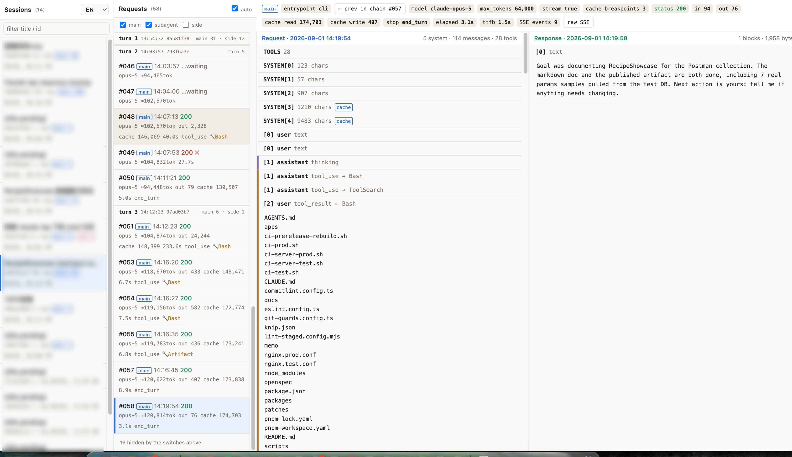

# claude-tap

抓下 Claude Code 实际发给 Anthropic API 的请求**和**返回的响应，在本地网页里左右对照着看。

[English →](README.md)



一个 [mitmproxy](https://mitmproxy.org) addon 蹲在 `POST /v1/messages` 前面，把每个请求和它的
流式响应按会话分目录落盘；配套一个只读的网页查看器把两边配对起来：左边请求，右边响应，一行一次
API 调用。

响应走 stream 回调，chunk 边转发边抄一份，**所以终端里的打字机效果不受影响**。

## 快速开始

```bash
./doctor.sh                       # 检查依赖、生成 mitmproxy CA 证书、检查端口
./start.sh                        # 后台起代理, 监听 127.0.0.1:8080
./view.py                         # 打开查看器 http://127.0.0.1:8899
source ./env.sh && claude         # 只有这个 shell 里的 claude 走代理
```

第一次用 `doctor.sh` 不能跳过：mitmproxy 的 CA 证书要等 mitmproxy 跑过一次才生成，没有它
`claude` 会报一个跟证书毫无关系的 TLS 错误，很难自己想到原因。

只有你 `source env.sh` 的那个 shell 受影响，不动任何全局配置。

停止：`./stop.sh`（代理）、`Ctrl-C` 或 `kill $(cat .view.pid)`（查看器）。

## 抓到的东西

```
captures/
  <session-id>/
    001-140846.json         请求:  url、headers(密钥已脱敏)、完整 body
    001-140846.resp.json    响应:  SSE 已组装回一条完整 message —
                            blocks(text/thinking/tool_use)、usage、stop_reason、
                            status、elapsed_ms、ttfb_ms
    001-140846.sse.txt      原始 SSE 事件流 (只有 TAP_RAW_SSE=1 时才存)
    _index.jsonl            一行一个请求: token 估算、cache 断点
    _title.txt              这个会话的 AI 标题
  by-title/
    <标题>--<id前8位> -> ../<session-id>    软链, 按名字找会话
```

请求和响应用同一个 `NNN-HHMMSS` 文件名前缀配对。`NNN` 是**抓包到达顺序，不是对话轮次** ——
见下面。

## 查看器

`./view.py` 在 `http://127.0.0.1:8899` 提供三栏：

| 栏 | 内容 |
|---|---|
| 会话 | 标题、id、请求数、构成（`主42 · 子2`） |
| 请求 | 按轮次分组，一行一次调用：类型标签、状态、token、耗时、调了哪个工具 |
| 详情 | 顶部 meta 条，下面**左边请求 / 右边响应** |

- 右上角切语言（**默认英语**，可选中文；选择记在 `localStorage`）
- `j` / `k` 上下切请求
- 响应里每个 `tool_use` 都有个 **看结果 →** 按钮，跳到下一个请求并高亮对应的 `tool_result`
- **← 本链上一次** 沿 `cc_prev_req` 回溯同一个 agent 循环
- 每 4 秒自动刷新，可以边抓边看

### 请求类型

一个会话目录里混着好几种 API 调用，不只是你的对话。查看器给每种打标签，旁路调用默认隐藏。

| 标签 | 判定依据 | 是什么 |
|---|---|---|
| **主对话** | `You are Claude Code, Anthropic's official CLI` 或 `You are a Claude agent, built on` | 对话本身（有 tools、有 `cc_prompt_id`） |
| **子agent** | 计费头里有 `cc_is_subagent=true` | 主循环派出去的 agent；缩进显示，并标注它的专业定位 |
| 起标题 | `You are naming a coding session` | 生成 `_title.txt` 的那次 haiku 小调用 |
| 安全审查 | `You are a security monitor for autonomous AI coding agents` | 审查每次工具调用，只回一个 `<severity>N` |
| 配额探针 | 无 system prompt、`max_tokens<=1` | 开终端时打的探针 |

请求按 `cc_prompt_id` 分**轮次**（一次用户提问一个值）。轮内用 `cc_prev_req` 把每个 agent 循环
串成链 —— 主 agent 和每个子 agent 各有自己的链，所以子 agent 的「上一次」指向的是上一个**子
agent** 请求，不会串到主链上。

这些标记来自 Claude Code 2.1.252。以后的 CLI 版本可能改名，那时标签会退化成 `?`。

## 脚本

| 脚本 | 用途 |
|---|---|
| `doctor.sh` | 自检：依赖、CA 证书、端口、会抓哪些 host |
| `start.sh` / `stop.sh` | 后台起 / 停 mitmdump 代理 |
| `view.py` | 网页查看器（只读，只监听 `127.0.0.1`） |
| `show.py` | 同样的数据在终端看 —— `./show.py --list`、`./show.py <id前缀> 003` |
| `watch.sh` | `tail -f` 代理日志，只留抓包摘要行 |
| `clean.sh` | 清理 `captures/` —— `--days N`、`--sse`、`--all`；不加 `--yes` 只 dry run |
| `env.sh` | `source` 一下，只让当前 shell 的 `claude` 走代理 |
| `on.sh` / `off.sh` | 另一种接入：把代理配置写进某个项目的 `.claude/settings.local.json`（或 `--global`） |
| `restore.sh` | 一键还原：移除注入的配置、卸载 launchd 服务、停代理 |

`on.sh` 是持久化配置，所以**代理没起的时候那个目录里的 `claude` 会直接连不上**。用 `off.sh`
撤销；`toggle.py list` 看当前哪些地方被写过。

## 环境变量

| 变量 | 默认 | 作用 |
|---|---|---|
| `TAP_PORT` | `8080` | 代理端口（`start.sh`、`env.sh`、`toggle.py` 都读它） |
| `TAP_VIEW_PORT` | `8899` | 查看器端口 |
| `TAP_DIR` | `./captures` | 抓包落盘位置 |
| `TAP_HOSTS` | — | 逗号分隔的 host 列表，覆盖自动检测 |
| `TAP_RAW_SSE` | 关 | 额外保留原始 `.sse.txt` 事件流 |
| `TAP_KEEP_AUTH` | 关 | **不脱敏** `Authorization` / `Cookie` / `x-api-key` |

### 第三方网关 / 中转

`tap.py` 默认抓 `api.anthropic.com`，外加它从 `ANTHROPIC_BASE_URL` / `ANTHROPIC_API_URL` 里发现
的 host —— 环境变量和 `~/.claude/settings.json` 的 `env` 块两处都看。如果你的网关配在别的地方，
设 `TAP_HOSTS=你的网关域名`。`doctor.sh` 第 5 步会直接打印当前生效的 host 列表，先确认再排查
「为什么什么都没抓到」。

## 安全

抓包内容包含你的完整对话、`CLAUDE.md`、以及工具读过的文件内容。认证头默认脱敏，除非你设了
`TAP_KEEP_AUTH=1` —— 开了之后**真 token 会明文落盘**。`captures/`、`proxy.log` 和 pid 文件都在
`.gitignore` 里。查看器只监听 `127.0.0.1`，不要暴露出去。

## 已知限制

- 面向 macOS：`launchctl`（可选的服务管理）、`lsof`、BSD 版 `find` 参数
- 请求分类绑在 Claude Code 2.1.252 的 prompt 和计费头上
- 会话标题取自 `~/.claude/projects/*/<session-id>.jsonl`，那个布局变了就一直显示「标题待生成」
- `captures/` 会无限增长 —— 用 `clean.sh` 清，没有任何自动清理
